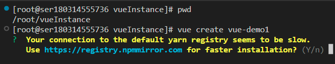
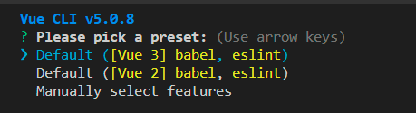
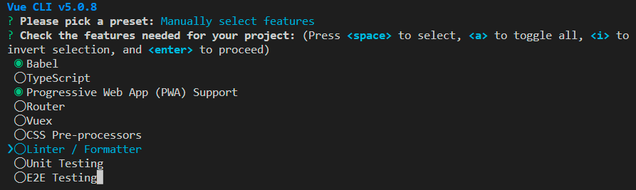
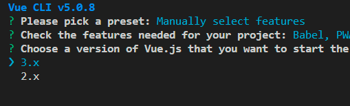
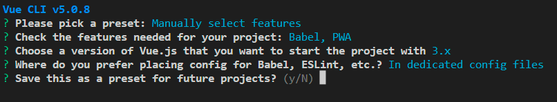
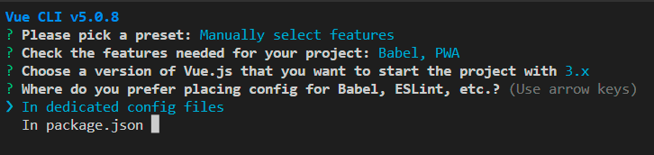
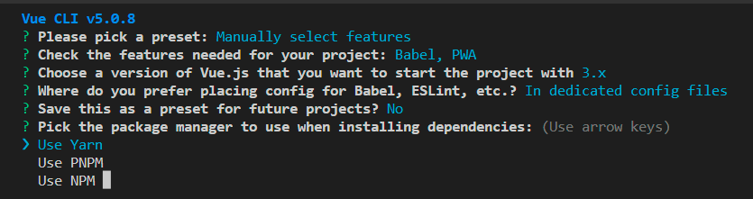

## Python 安装
    - wget  https://www.python.org/ftp/python/3.9.10/Python-3.9.10.tgz
    - 

## Centos换源
   - 以阿里云为例子
    - cd /etc/yum.repos.d/
    - cp CentOS-Base.repo CentOS-Base.repo.bak(对镜像基础文件进行备份)
    - wget http://mirrors.aliyun.com/repo/Centos-7.repo(下载镜像文件)
    - mv Centos-7.repo CentOS-Base.repo(替换为镜像基础文件)# 清除缓存：
    - yum clean all(清除缓存)
    - yum makecache(生成缓存)
    - yum update && yum upgrade -y(更新)
## C++升级
    - yum  -y install  devtoolset-8-gcc devtoolset-8-gcc-c++(安装gcc1-0)
    - rpm -ql devtoolset-8-gcc-8.2.1-11.2.el7.x86_64(查看安装路径)
    - 配置环境变量
        - echo "source /opt/rh/devtoolset-8/enable" >> /etc/profile()
        - source /etc/profile
    - [c++升级和make升级](https://blog.csdn.net/qq_38225558/article/details/128641561)
    - 安装 yum install libstdc++.so.6 -y 
        - 遇到的问题：Running Transaction Test
            - rm -rf /var/lib/rpm/__db*
            - yum clean all
            - rpm -v rebuilddb
    - 遇到的问题：Another app is currently holding the yum lock; waiting for it to exit.
        - 解决方式：rm -f /var/run/yum.pid

## NodeJS 安装cd /etc/yum.repos.d/
    - [Nodojs](https://nodejs.org/dist/v18.15.0/node-v18.15.0-linux-x64.tar.xz)
        - 注意选择对应正确的版本，因为源码包编译安装时间会特别长，我编译了8个小时没有编译完成最终放弃
    - [nodejs安装](https://blog.csdn.net/Rakers1024/article/details/128061641)
    - 遇到的问题(LINUX These critical programs are missing or too old: bison compiler python)
        - 解决方式：yum -y install bison
## 安装vue工具 Vue CLI

 - Vue CLI Vue.js开发的标准工具, Vue CLI是一个Vue.js进行快速开发的完整系统
  - npm install -g @vue/cli
 - 查看版本信息 vue --version
  - vue --version
## 创建一个项目
    - vue create vue-demo(vue create 项目名称(项目名称不可以大写，但是可以使用-相连))
    - 在控制台中，可以使用上下按键调整选择项
    - 在控制台中，可以使用空格选择和取消选择项
    - 可以使用默认模板，或者手动选取需要的特性
    - 
    - 
    - 
    - 
    - 
        - 是否保存为未来项目的预设
    - 
    - 
    - 运行项目
        -cd vue-demo1
        -npm rum serve

