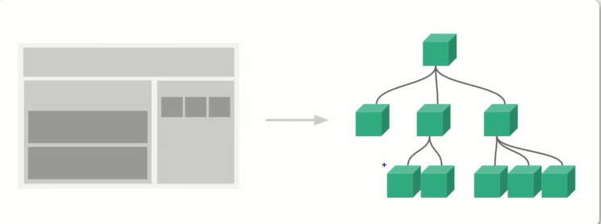

## Python 安装
    - wget  https://www.python.org/ftp/python/3.9.10/Python-3.9.10.tgz
    - 

## Centos换源
   - 以阿里云为例子
        - cd /etc/yum.repos.d/
        - cp CentOS-Base.repo CentOS-Base.repo.bak(对镜像基础文件进行备份)
        - wget http://mirrors.aliyun.com/repo/Centos-7.repo(下载镜像文件)
        - mv Centos-7.repo CentOS-Base.repo(替换为镜像基础文件)# 清除缓存：
        - yum clean all(清除缓存)
        - yum makecache(生成缓存)
        - yum update && yum upgrade -y(更新)
## C++升级
   - yum  -y install  devtoolset-8-gcc devtoolset-8-gcc-c++(安装gcc1-0)
   - rpm -ql devtoolset-8-gcc-8.2.1-11.2.el7.x86_64(查看安装路径)
   - 配置环境变量
        - echo "source /opt/rh/devtoolset-8/enable" >> /etc/profile()
        - source /etc/profile
   - [c++升级和make升级](https://blog.csdn.net/qq_38225558/article/details/128641561)
   - 安装 yum install libstdc++.so.6 -y 
        - 遇到的问题：Running Transaction Test
        - rm -rf /var/lib/rpm/__db*
        - yum clean all
        - rpm -v rebuilddb
   - 遇到的问题：Another app is currently holding the yum lock; waiting for it to exit.
   - 解决方式：rm -f /var/run/yum.pid

## NodeJS 安装cd /etc/yum.repos.d/
   - [Nodojs](https://nodejs.org/dist/v18.15.0/node-v18.15.0-linux-x64.tar.xz)
        - 注意选择对应正确的版本，因为源码包编译安装时间会特别长，我编译了8个小时没有编译完成最终放弃
   - [nodejs安装](https://blog.csdn.net/Rakers1024/article/details/128061641)
   - 遇到的问题(LINUX These critical programs are missing or too old: bison compiler python)
        - 解决方式：yum -y install bison
## 安装vue工具 Vue CLI

   - Vue CLI Vue.js开发的标准工具, Vue CLI是一个Vue.js进行快速开发的完整系统
        - npm install -g @vue/cli
   - 查看版本信息 vue --version
        - vue --version
## 创建一个项目
   - vue create vue-demo(vue create 项目名称(项目名称不可以大写，但是可以使用-相连))
   - 在控制台中，可以使用上下按键调整选择项
   - 在控制台中，可以使用空格选择和取消选择项
   - 可以使用默认模板，或者手动选取需要的特性
   - 
   - 
   - 
   - 
   - 
        - 是否保存为未来项目的预设
   - 
   - 
   - 运行项目
        - cd vue-demo1
        - npm rum serve
   - vscode高亮插件 volar
## VUE项目的结构
   - src源文件
        - assets 资源文件
        - components 模板文件
            - 第一个模板HelloWorld.vue
                    - <template> html模块 </template>
                    - 
                    - 
        - APP.vue模板的主入口
## vue-demo1
   - data() {
        return {
            message:"message"
        }
     }
     data()函数用于控制变量的动态显示
   - 原始HTML:双大括号会将数据解释为普通文本，而非HTML代码，为了输出真的HTML,可以使用v-html
   - 属性的动态修改 v-bind
        - 

 v-bind:可以简写为:
   - 使用JavaScript表达式, Vue.js都提供了完全的JavaScript表达式支持
        - {{ number + 1 }}
        - {{ ok ? 'YES' : 'NO'}}
        - {{ message.split('').reverse().join('') }}
        - 注意：每一个绑定只能够包含单个表达式,下面例子不会生效
            -  {{ var a = 1 }} 这是语句, 不是表达式
            -  {{ if (ok) { return message } }} 这是控制流

## vue-demo2
   - 条件渲染
        - v-if
        - v-else
        - v-show
   - v-if和v-show的区别
        - v-if 是"真正"的条件渲染，因为它确保在切换的过程中, 条件内的监听器和子组件适当地被销毁和重建
        - v-if 是惰性的：如果在初始渲染时条件为假,则什么也不做直到条件第一次变为真的,才开始渲染条件模块
        - 相比之下, v-show 不管初始条件是什么,元素总是会被渲染,并且只是简单Css切换, 一般来说, v-if有更高的切换开销,而v-show有更高的初始渲染开销,因此频繁的切换,则使用v-show,
        如果在运行时条件很少改变,则使用v-if较好

## vue-demo3
   - 列表渲染
       - v-for指定基于数组来渲染一个列表, v-for指定需要使用item in items形式的特殊语法,items是源数据数组,而item则是被迭代的数组的别名。
       - 例子
           - <ul> <li v-for="item in items">{{ item.message }}</li> </ul>
           - data() {
                return {
                    newList:[
                        {
                            id:1001,
                            title:"今日头条1"
                        },
                        {
                            id:1002,
                            title:"今日头条2"
                        },
                        {
                            id:1003,
                            title:"今日头条3"
                        },
                        {
                            id:1004,
                            title:"今日头条4"
                        },
                        ]
                    }
                }
## vue-demo4
   - 监听事件
       - 使用v-on指定(通常缩写为@符号)来监听DOM事件,并在触发事件时执行一些JavaScript。用法为v-on:click="methodName"或使用快捷方式@click="methodName"
   - 事件监听方法
       - 
   - 内联处理器的方法

## vue-demo5
   - 表单的输入绑定
       - v-model指定在表单<input>,<textarea>及<select>元素上创建双向数据绑定。它会根据控件类型自动选取正确的方法来更新元素。v-model本质不过是语法糖,它负责监听用户的输入事件来更新数据,并且在某种极端场景下进行一些特殊处理。
   - .lazy修饰符号
       - 在默认情况下, v-model在每次input事件触发后，输入框的值与数据进行同步,添加lazy修饰符之后转为change事件之后进行同步
   - .trim
       - 去除输入框之后的空格
## vue-demo6
   - 组件基础
       - 引入组件 import MyComponentVue from './components/MyComponent.vue'
       - 挂载组件 components:{MyComponentVue}
       - 显示组件 <my-componentVue/>
   - vue的组织架构
       -  
## vue-demo7
   - Props组件交互
       - 遇到的问题
           - 问题1： ENOSPC: System limit for number of file watchers reached
           - 原因：文件监视程序的系统产生了限制，达到了默认的上限，需要增加限额
           - 解决方法：
                - 临时增加限额数量：
                    -  sysctl fs.inotify.max_user_watches=524288
                    -  sysctl -p
                - 永久增加限额数量:
                    -  echo fs.inotify.max_user_watches = 524288 | sudo tee -a /etc/sysctl.conf 
                    -  sysctl -p
           - 问题二：Component name "Mycomponent" should always be multi-word
           - 原因：格式问题,模板的名称必须是多个单词,用-连接
           - 解决办法
                -  name: 'my-component' 
## vue-demo8
   - 自定义事件交互：自定义事件可以组件中反向传递数据,props可以实现父组件向子组件传递数据,$emit可以实现数据的反向传递
   - 遇到的问题：
       - 自定义事件的后定义的处理事件不需要添加()
       - 举例 自定义事件为this.$emit("onEvent", message)
       - 父组件的接收函数 <my-component @onEvent="getDataHandle"/> // getDataHandle()是错误的
       - 
## vue-demo9
   - vue的生命周期
       - 创建时：beforeCreate  created
       - 渲染时：beforeMount  mounted
       - 更新时：beforeUpdate updated
       - 卸载时：beforeUnmount unmounted
## vue-demo10
   - vue引入第三方框架
       - swiper
       - !(官方文档)[https://swiperjs.com/vue]
       - 安装指定的版本：npm install --save swiper@8.1.6
## vue-demo11
   - Axios网络请求库
   - 安装：npm install --save axios
   - 安装：npm install --save querystring post请求处理包
   - 组件引入：import axios from "axios"
   - 组件引入: import querystring from "querystring"
  
## vue-demo12
   - 网络请求的封装

## vue-demo13
   - 网络请求的跨域
   - js采取的是同源策略, 同源策略是浏览器的一项安全策略, 浏览器只允许js代码请求和当前所在服务器域名,端口,协议相同的数据接口上的数据,这就是同源策略, 也就是当域名,协议,端口任意一个不同时,都会产生跨域问题。
   - 后台策略：cors
   - 前台策略：proxy  
   - 配置跨域之后需要重启服务，才能够生效

## vue-demo14
   - 路由配置:vue-router管理页面之间的关系
   - 安装组件：npm install --save vue-router

## vue-demo16
   - 路由嵌套配置

## vue-demo17
   - vuex状态管理
   - 安装方式 npm install --save vuex

## vue-demo18
   - 状态管理核心
   - Getter: 对vuex的数据进行过滤
   - Mutation 对store中状态进行更改
   - Action 类似于mutation 不同在于Action提交的是mutation,而不是直接变更状态,Action包含任意异步操作

## vue-demo19
   - vue3的新特性
   - 组合API
   - 

    

